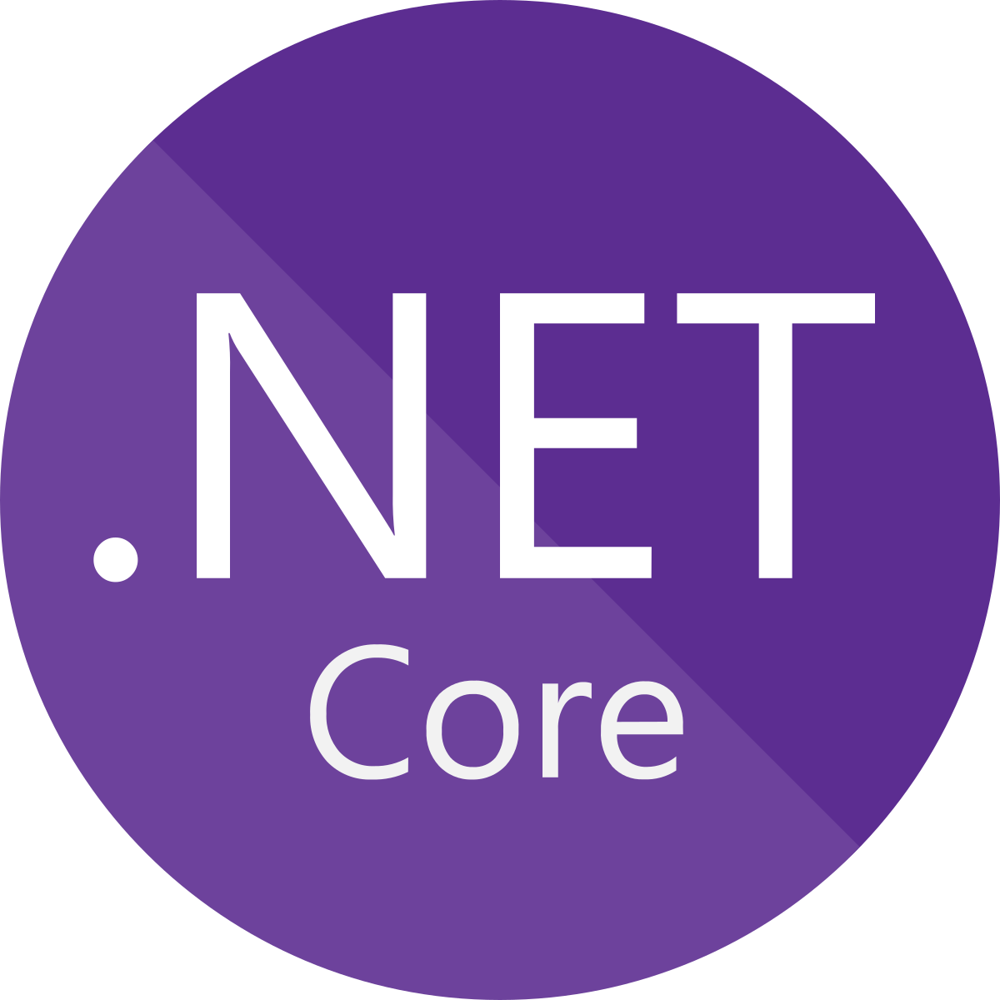
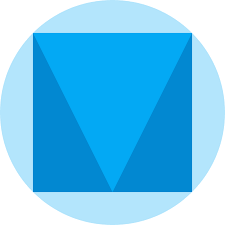

  

<ul>
  <li>
    📬 Contact me at <a href="mailto:contact@curtisdale.ca">contact@curtisdale.ca</a>
  </li>
  <li>
    🎓 Currently learning Data structures and Algorithms.
  </li>
  <li>
    🤝  Open to collaborating on interesting projects.
  </li>
  <li>
    🤓  Interested in AI demographic predictions.
  </li>
</ul>
 

<h2>👋 Socials </h2>

 

<h2>🛠️ Skills</h2>

  
  
  
  
  
  
  
  
  
  
  
  
  
  
  
  
  
  
  
  
  
  
  
  
  
  

 

